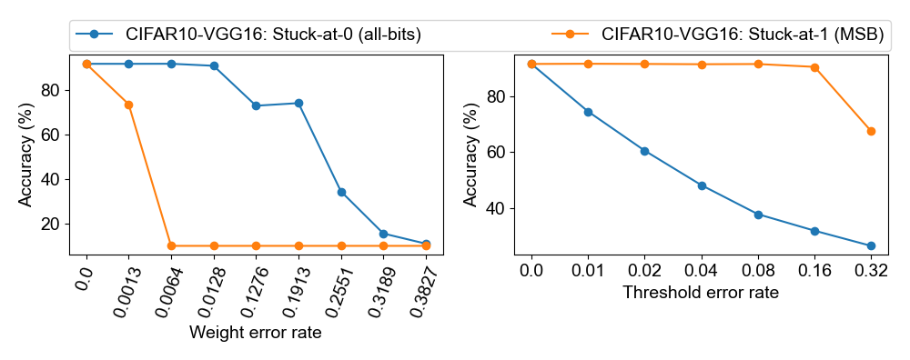

# Fault insertion into Deep Spiking Neural Networks

This code inserts faults into weights and thresholds.

To modify weight, use `modify_snn_weight.py`. The weight of SNN can be download here
* [VGG16 CIFAR10](https://purdue0-my.sharepoint.com/:u:/g/personal/rathi2_purdue_edu/EbRwkK0yO-lEjnN2Is2rGhwBtFEeO5WZG0JtWl_107sqvg?e=gBQUwo)

To insert fault in SNN (VGG), check `self_models/vgg_spiking.py`, line 100-105

```
		self.frate = 0.01
		self.fault = {}
		self.ftype = 'stuck-at-zero' # 'stuck-at-one'
		self.finit = False
		self.f_threshold = {}
```

The accuracy for pretrained SNN can be seen in ``logs/snn/`` folder.


Caption: The accuracy vs error rate.

<br><br><br><br><br>

---

The following content is the orginial README file
[https://github.com/nitin-rathi/hybrid-snn-conversion]


# Enabling Deep Spiking Neural Networks with Hybrid Conversion and Spike Timing Dependent Backpropagation

This is the code related to the paper titled "Enabling Deep Spiking Neural Networks with Hybrid Conversion and Spike Timing Dependent Backpropagation" published in [ICLR, 2020](https://openreview.net/forum?id=B1xSperKvH)

# Training Methodology
The training is performed in the following two steps:
* Train an ANN ('ann.py')
* Convert the ANN to SNN and perform spike-based backpropagation ('snn.py')
# Files
* 'ann.py' : Trains an ANN, the architecutre, dataset, training settings can be provided an input argument
* 'snn.py' : Trains an SNN from scratch or performs ANN-SNN conversion if pretrained ANN is available.
* /self_models : Contains the model files for both ANN and SNN
* 'ann_script.py' and 'snn_script.py': These scripts can be used to design various experiments, it creates 'script.sh' which can be used to run multiple models
# Trained ANN models
* [VGG5 CIFAR10](https://purdue0-my.sharepoint.com/:u:/g/personal/rathi2_purdue_edu/EeRnXta_mUlAspqjAYoRV_kB-7MFWCFg2dr1QkClhP1QZw?e=b0N6fu)
* [VGG16 CIFAR10](https://purdue0-my.sharepoint.com/:u:/g/personal/rathi2_purdue_edu/EVQNuuHVX7xKppDaS_eEFRgBsgoMdjfF-IA7CQz_NV8YDA?e=nCVd2a)
* [VGG11 CIFAR100](https://purdue0-my.sharepoint.com/:u:/g/personal/rathi2_purdue_edu/EeiWohdj0dNLp1rw0CxZ9AEBMwoFVyllUBVzf6AzY5pzUg?e=G3u8gT)

# Trained SNN models
* [VGG5 CIFAR10](https://purdue0-my.sharepoint.com/:u:/g/personal/rathi2_purdue_edu/EdT_NJNpyhtKtVkAz28F8-kBv0jPwuAFfJ_5jwqgMHRzAQ?e=yVAMZY)
* [VGG16 CIFAR10](https://purdue0-my.sharepoint.com/:u:/g/personal/rathi2_purdue_edu/EbRwkK0yO-lEjnN2Is2rGhwBtFEeO5WZG0JtWl_107sqvg?e=gBQUwo)
* [VGG11 CIFAR100](https://purdue0-my.sharepoint.com/:u:/g/personal/rathi2_purdue_edu/EeJz41FHZVpCvL6yZqWJtyIB3wRcUsnudsPp7QYiWPpH5w?e=gh74Vo)

# Issues
* Sometimes the 'STDB' activation becomes unstable during training, leading to accuracy drop. The solution is to modulate the alpha and beta parameter or change the activation to 'Linear' in 'main.py'
* Another reason for drop in accuracy could be the leak parameter. Please change 'leak_mem=1.0' in 'main.py'. This changes the leaky-integrate-and-fire (LIF) neuron to integrate-and-fire (IF) neuron.

# Citation
If you use this code in your work, please cite the following [paper](https://openreview.net/forum?id=B1xSperKvH)
```
@inproceedings{
Rathi2020Enabling,
title={Enabling Deep Spiking Neural Networks with Hybrid Conversion and Spike Timing Dependent Backpropagation},
author={Nitin Rathi and Gopalakrishnan Srinivasan and Priyadarshini Panda and Kaushik Roy},
booktitle={International Conference on Learning Representations},
year={2020},
url={https://openreview.net/forum?id=B1xSperKvH}
}
```

